# Finegrain implementation plan

Updated for the three-part application and the decision to reuse **garrytan/gbrain**.
The supplied [original brief](original-project-brief.md) remains the planning artifact. This plan records the current scope where later decisions differ.

## Ownership and architecture

```mermaid
flowchart LR
  A[Claude · Codex · Pi · other agents] --> B[Mac menu-bar companion]
  B --> C[Official personal Gbrain · PGLite]
  C -->|approved compiled pages only| D[Gbrain OAuth + revision-checked relay]
  D --> E[Official company Gbrain · Postgres]
  E --> F[Finegrain curriculum compiler]
  F --> G[River teacher + independent critic]
  G --> H[SFT · RL environments · held-out tests]
  H --> I[River student training]
  I --> J[Evaluation and promotion gate]
```

Gbrain owns both brains: initialization, storage, source routing, scopes, OAuth, revisions, and its existing company dashboard. Finegrain adds a small companion, a relay that calls the official CLI, and the training system. No substitute Gbrain database, duplicate identity system, or raw session upload endpoint.

## Deliverables

1. **Employee installation.** One terminal installer; reuse an existing personal Gbrain or initialize keyless PGLite through upstream. Pair a separate upstream thin-client profile with company OAuth credentials. Select project folders that may contribute compiled notes. Build a native macOS menu-bar app with pause/resume, worker status, company dashboard, and settings.
2. **Capture and local compilation.** Read existing session files incrementally; tolerate incomplete writes and file rotation. Use Gbrain's native transcript import for Claude and Codex. Pi/generic JSONL adapters fill unsupported formats. Native ingestion remains local. A conservative local extractor selects explicit user-stated conventions; optional loopback model selects grounded statements. Gbrain's richer synthesis can continue independently under its existing configuration.
3. **Compiled-memory relay.** Query explicitly marked pages from personal Gbrain. Copy only compiled body/title and minimal hashed provenance to `employees/<id>/` in a shared company source. Use upstream OAuth and revision/request IDs. Retry stable writes and withdraw previously shared pages when approval is removed. Never transmit transcript journals, `raw_data`, timelines, or local paths.
4. **Company deployment.** Docker Compose: official pinned Gbrain + pgvector Postgres + Finegrain worker. Use Gbrain's `/admin/` page for knowledge and access management. Finegrain's small console shows only training status. The same stack runs in a laptop sandbox or a VM with HTTPS in front.
5. **Curriculum generation — primary product.** Company source only, explicit training eligibility. Strong River teacher and separate critic, exact evidence validation, cached incremental page generation, source-separated evaluation, deduplication, four task kinds, fixed general checks, and inspectable artifacts.
6. **Training.** River SFT then bounded RL. The first company run starts from and evaluates against the GM foundation checkpoint; later runs resume from the last promoted company checkpoint. Evaluate base/current/intermediate/candidate, preserve checkpoints, and promote only after improvement without factual or general regressions. Nightly default; weekly, monthly, manual, and once remain supported. Training executes remotely; orchestration/data artifacts stay on the company host.
7. **Validation.** Unit and integration tests for trace handling, compiled-only relay, permissions, idempotency, dataset leakage, rewards, scheduling, provider contracts, and promotion. Build the Mac app and Docker image. Exercise official personal/company Gbrain in an isolated synthetic sandbox. Record live River generation separately from offline tests and live training.

## Quality boundaries

- A shared adapter may contain only knowledge suitable for **everyone who can use it**. Gbrain source ACLs do not survive model training. Restrict the training service to the designated shared source.
- Facts stay authoritative in Gbrain. Changed or withdrawn material invalidates future datasets; published model weights cannot be surgically erased. Rebuild from the GM foundation checkpoint (or the raw base when no foundation is configured) when training lineage is withdrawn.
- GM and Finegrain must use the same River base model and compatible LoRA configuration. Finegrain records the GM checkpoint as foundation provenance and rebuilds withdrawn company lineage from GM, not raw Qwen.
- The initial local extractor is intentionally narrow; it does not infer facts from arbitrary tool logs or assistant guesses. Better local synthesis is a replaceable component, not a new authoritative brain.
- Teacher selection is configurable. The account exposes Kimi K2.6, GLM 5.2 and other large models; no unverified claim that one is universally strongest.
- No per-employee adapters, custom teacher training, other training providers, or cloud deployment automation in this release.

## Remaining rollout work

After a local sandbox passes: provide the real company hostname and Gbrain profile, create three scoped teammate handoffs, run the installer on each computer, and choose shared projects. Code signing/notarization is needed for a frictionless public Mac download; the source build uses an ad-hoc local signature. Google Cloud deployment needs the project/VM and domain; Compose itself stays portable.
